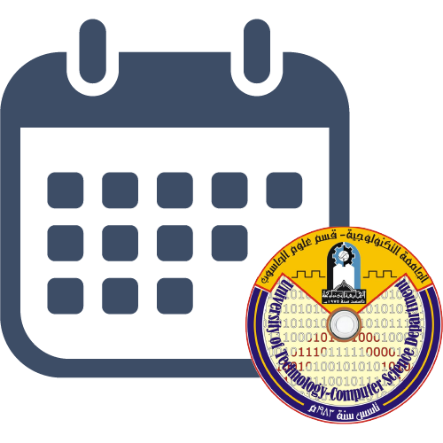
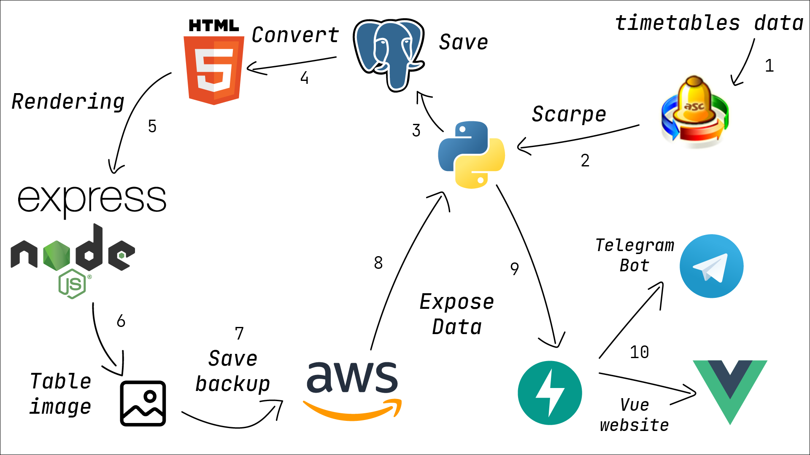

# University of technology Computer Science Department App

___
**Unofficial Telegram bot for LMS**

**Bot id:** [@csuotbot](https://t.me/csuotbot)

If you ar Teacher, Administrator or Supervisor in department of Computer Science please contact me to make it official
💙

## Telegram bot Features  :

* Timetables 📅
    * Teachers 👩‍🏫
    * Classrooms 🏫
    * Classes 🎓
    * Lesson 📖

* More coming soon...

## Example

## Stack

Coming soon...

## How to use

* Rename .env.development to .env and set it's value

## Frontend (Vue)

[Checkout this repo](https://github.com/noor3030/csuot-app)

## Dashboard (Vue) 

[Checkout this repo](https://github.com/noor3030/csuot-dashboard)

## HTML to Image

[Checkout this repo](https://github.com/masreplay/html-to-image)

## aSc TimeTable scrape

Data Scraping from [*aSc TimeTables software*](https://asctimetables.com/)
and [aSc edupage website](edupage.org/timetable)
